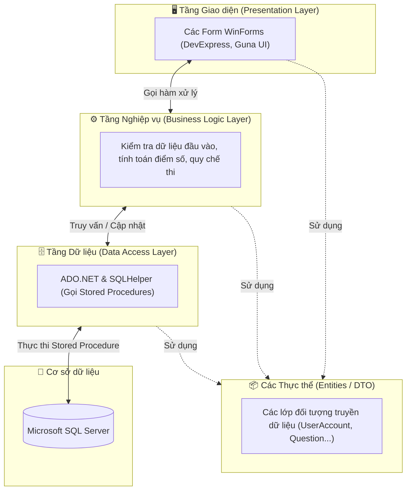
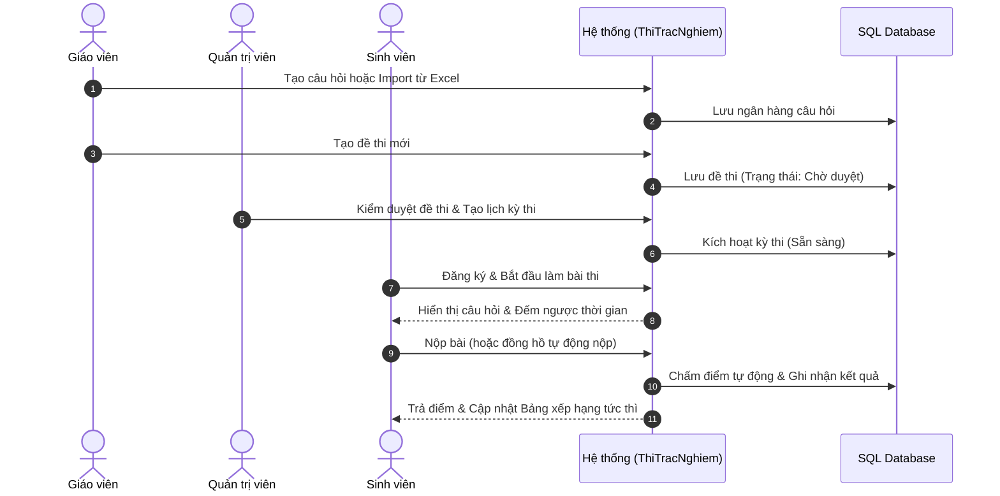
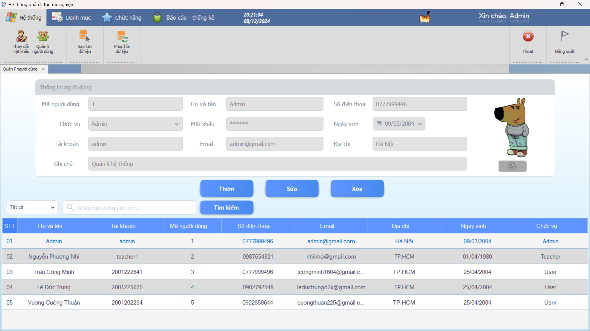
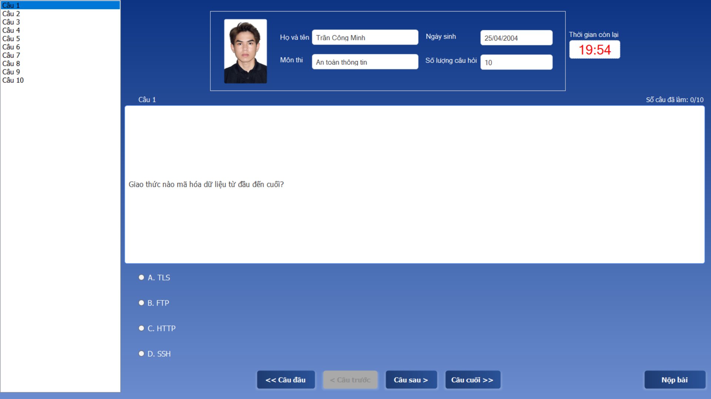

<div align="center">

# 🎓 HỆ THỐNG THI TRẮC NGHIỆM TRỰC TUYẾN (EXAM PORTAL)

[](https://dotnet.microsoft.com/)
[](https://www.microsoft.com/sql-server)
[](https://www.devexpress.com/)
[](https://gunaui.com/)
[](https://opensource.org/licenses/MIT)

**Đồ án môn học: Xây dựng hệ thống tổ chức và quản lý thi trắc nghiệm trực tuyến trên nền tảng .NET Windows Forms.**

[**📌 Thông Tin Đồ Án**](#2-thông-tin-đồ-án) • [**✨ Tính Năng**](#3-tính-năng-chính) • [**⚙️ Kiến Trúc**](#4-kiến-trúc--công-nghệ) • [**🚀 Cài Đặt & Chạy**](#5-hướng-dẫn-cài-đặt--chạy-dự-án) • [**📸 Hình Ảnh Demo**](#7-giao-diện-thực-tế)

---

</div>

## 1. Tiêu đề & Mô tả

**Hệ thống Thi Trắc Nghiệm** là sản phẩm phần mềm được thiết kế theo mô hình kiến trúc 3 tầng (3-Tier Architecture) trên nền tảng .NET Framework 4.8.1. Ứng dụng mô phỏng và giải quyết trọn vẹn quy trình thi trắc nghiệm: từ khâu khởi tạo ngân hàng câu hỏi, import dữ liệu, kiểm duyệt đề thi, tổ chức thi với đếm ngược thời gian, chấm điểm tự động đến trích xuất các báo cáo thống kê đa chiều.

---

## 2. Thông tin đồ án

*   **Tên dự án:** Phần mềm Quản lý và Tổ chức Thi trắc nghiệm trực tuyến.
*   **Trường:** Đại học Công Thương TP.HCM (HUIT)
*   **Khoa:** Công nghệ thông tin (CNTT)
*   **Tác giả (Chủ sở hữu):** Trần Công Minh
*   **Thành viên cộng tác:** Lê Đức Trung (MSSV: 2001225676)
*   **Mục đích:** Đồ án môn học / Sản phẩm nghiên cứu và ứng dụng thực hành kiến trúc phần mềm.

> [!IMPORTANT]
> **Lưu ý:** Đây là sản phẩm đồ án môn học phục vụ nghiên cứu và học tập trong nhà trường, không phải hệ thống thương mại (production-ready). Dự án được mở mã nguồn để chia sẻ kiến thức và thảo luận học thuật.

---

## 3. Tính năng chính

Ứng dụng phân quyền chặt chẽ với ba phân hệ người dùng hoạt động độc lập:

### 👨‍🎓 Phân hệ Sinh viên (User)
*   **Giao diện làm bài tập trung:** Thiết kế tối giản, trực quan, hỗ trợ danh sách câu hỏi dễ dàng nhảy đến câu mong muốn.
*   **Thao tác nhanh bằng phím tắt:** Bấm trực tiếp các phím `A`, `B`, `C`, `D` để chọn đáp án và mũi tên `←` / `→` để sang câu khác.
*   **Giám sát thời gian thực:** Đồng hồ đếm ngược theo từng giây, hệ thống tự động khóa và nộp bài khi hết giờ.
*   **Xem điểm & Bảng xếp hạng:** Xem ngay điểm số sau khi hoàn thành và theo dõi vị trí trên Bảng xếp hạng (Leaderboard) theo từng môn học.

### 👨‍🏫 Phân hệ Giáo viên (Teacher)
*   **Quản lý câu hỏi & Đề thi:** Thêm, sửa, xóa câu hỏi, phân loại theo chuyên đề và mức độ khó.
*   **Nhập liệu tự động từ Excel:** Tích hợp thư viện EPPlus cho phép import hàng trăm câu hỏi từ file Excel theo biểu mẫu chuẩn chỉ trong vài giây.
*   **Tạo đề thi linh hoạt:** Tự động sinh đề thi ngẫu nhiên từ ngân hàng câu hỏi hoặc chỉ định thủ công.
*   **Thống kê & Báo cáo:** Xuất danh sách bảng điểm sinh viên, thống kê tỷ lệ đạt/trượt ra file PDF hoặc Excel.

### 🛡️ Phân hệ Quản trị viên (Admin)
*   **Quản lý người dùng & Môn học:** Cấp tài khoản, phân quyền (Admin, Teacher, User) và gán giáo viên phụ trách môn học.
*   **Kiểm duyệt quy trình thi:** Xem xét và phê duyệt các đề thi do giáo viên nộp trước khi đưa vào kỳ thi chính thức.
*   **Sao lưu & Khôi phục (Backup/Restore):** Tích hợp tính năng tạo bản sao lưu dữ liệu (backup) và khôi phục trực tiếp CSDL SQL Server ngay trên giao diện ứng dụng.

---

## 4. Kiến trúc & Công nghệ

### Công nghệ sử dụng
*   **Ngôn ngữ & Nền tảng:** C# 7.3, .NET Framework 4.8.1, WinForms.
*   **Cơ sở dữ liệu:** Microsoft SQL Server (sử dụng Stored Procedures để tối ưu hóa truy vấn).
*   **Giao diện (UI/UX):** DevExpress v22.2.3 (Bảng biểu, Báo cáo, Đồ thị), Guna.UI2 v2.0.4.6, DevComponents.DotNetBar2.
*   **Xử lý tệp tin:** EPPlus 7.5.1 (xử lý Excel), iTextSharp (xử lý PDF).

### Kiến trúc 3 tầng (3-Tier Architecture)

Dự án áp dụng chặt chẽ mô hình phân tầng chuẩn mực, tách biệt hoàn toàn Giao diện, Xử lý nghiệp vụ và Tương tác dữ liệu:



### Luồng quy trình hoạt động kỳ thi



---

## 5. Hướng dẫn cài đặt & Chạy dự án

### Bước 1: Chuẩn bị CSDL
1. Mở SQL Server Management Studio (SSMS).
2. Tạo một cơ sở dữ liệu rỗng mang tên `QL_THITRACNGHIEM2`.
3. Thực hiện khôi phục (Restore) dữ liệu từ file backup chuẩn có sẵn trong kho mã nguồn:
   `Database/QL_THITRACNGHIEM2-20-05-2025--22-37-33.bak`

### Bước 2: Cấu hình môi trường (App.config)
Tại thư mục project `ThiTracNghiem`, sao chép file cấu hình mẫu `App.config.example` thành `App.config` và điều chỉnh thông số chuỗi kết nối CSDL và tài khoản email khôi phục mật khẩu:

```xml
<?xml version="1.0" encoding="utf-8" ?>
<configuration>
    <startup>
        <supportedRuntime version="v4.0" sku=".NETFramework,Version=v4.8.1" />
    </startup>
    
    <!-- CẤU HÌNH CHUỖI KẾT NỐI DATABASE -->
    <connectionStrings>
        <add name="testConnection" 
             connectionString="Server=.\SQLEXPRESS;Database=QL_THITRACNGHIEM2;Integrated Security=True;" />
    </connectionStrings>
    
    <!-- CẤU HÌNH EMAIL GỬI MÃ KHÔI PHỤC -->
    <appSettings>
        <add key="SmtpHost" value="smtp.gmail.com" />
        <add key="SmtpPort" value="587" />
        <add key="SmtpUsername" value="your-email@gmail.com" />
        <add key="SmtpPassword" value="your-app-password" /> <!-- Mật khẩu ứng dụng 16 ký tự -->
        <add key="SmtpEnableSsl" value="true" />
    </appSettings>
</configuration>
```

### Bước 3: Biên dịch & Chạy thử nghiệm
1. Mở solution `ThiTracNghiem.sln` bằng Visual Studio 2022. Visual Studio sẽ tự động khôi phục các gói NuGet.
2. Đặt project `ThiTracNghiem` làm **Startup Project** (chuột phải vào project -> `Set as Startup Project`).
3. Nhấn `F5` hoặc chọn nút `Start` để chạy ứng dụng.
4. Đăng nhập để trải nghiệm bằng các tài khoản kiểm thử mặc định:

| Phân hệ | Tên đăng nhập (Username) | Mật khẩu (Password) | Chức năng kiểm thử |
| :--- | :--- | :--- | :--- |
| **Quản trị viên (Admin)** | `admin` | `123456` | Quản lý hệ thống, duyệt đề thi, sao lưu CSDL |
| **Giáo viên (Teacher)** | `teacher` | `123` | Nhập câu hỏi Excel, tạo đề thi, xem bảng điểm |
| **Sinh viên (User)** | `2001222641` | `123` | Đăng ký kỳ thi, làm bài trắc nghiệm, xem thứ hạng |

---

## 6. Cấu trúc thư mục dự án

```text
ThiTracNghiem/
├── 📁 Avatar_Image/            # Bộ ảnh đại diện (avatar) kiểm thử của người dùng
├── 📁 Báo cáo Word/            # Các tài liệu phân tích thiết kế & báo cáo đồ án (PDF/DOCX)
├── 📁 Database/                # Script SQL và file sao lưu CSDL mẫu (.bak)
├── 📁 Images/                  # Các icon, hình ảnh đồ họa sử dụng trên giao diện
├── 📁 Test_AddSubjectExcel.xlsx # File Excel dữ liệu mẫu dùng để test import câu hỏi
├── 📁 Entities/                # [Tầng DTO] Định nghĩa các thực thể (UserAccount, Question, Exam...)
├── 📁 DataAccessLayer/         # [Tầng DAL] Tương tác CSDL SQL Server qua SQLHelper
├── 📁 BusinessLogicLayer/      # [Tầng BLL] Chứa các hàm nghiệp vụ, quy chế thi và tính điểm
├── 📁 TestCore/                # Các lớp hỗ trợ kết nối và kiểm thử tự động
└── 📁 ThiTracNghiem/           # [Tầng GUI] Tầng giao diện chính (Windows Forms)
    ├── 📁 Reports/             # Các mẫu xuất báo cáo điểm số (DevExpress Repx / PDF)
    ├── App.config.example      # File cấu hình mẫu an toàn
    ├── frmLogin.cs             # Form đăng nhập hệ thống
    ├── frmTest.cs              # Form làm bài thi trắc nghiệm
    └── ...
```

---

## 7. Giao diện thực tế

### Màn hình đăng nhập


### Bảng quản trị người dùng & phân quyền


### Phòng thi trực tuyến với đồng hồ đếm ngược


---

## 8. Giấy phép

Dự án được phát hành dưới giấy phép mã nguồn mở **MIT License**. Chi tiết vui lòng xem tại tệp [LICENSE](./LICENSE).

---

<div align="center">

**© 2025 Hệ thống Thi Trắc Nghiệm. Sản phẩm thuộc Đồ án môn học.**  
*Khoa Công nghệ thông tin (CNTT) - Đại học Công Thương TP.HCM (HUIT)*

🐙 **GitHub:** [@dexter826](https://github.com/dexter826)

</div>
